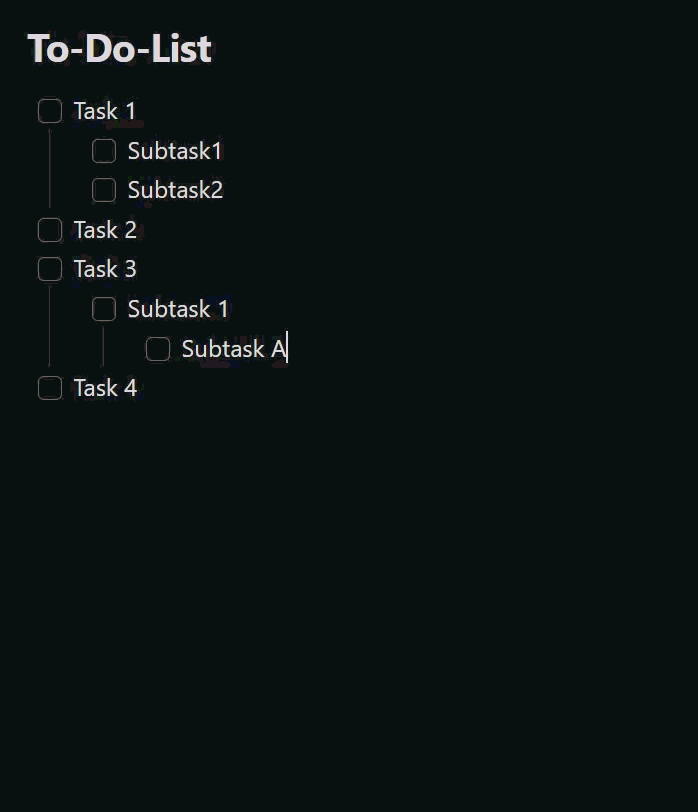

# To-Do to Done Mover

Ein [Obsidian](https://obsidian.md)-Plugin, das erledigte Checkbox-Aufgaben –
inklusive ihrer eingerückten Unteraufgaben – schnell aus einer To-Do-Liste in
einen `### Done`-Abschnitt derselben Notiz verschiebt.

🌍 **Sprachen:** [English](README.md) · Deutsch (diese Seite)
Die Plugin-Oberfläche richtet sich nach der Obsidian-Sprache: standardmäßig
Englisch, Deutsch wenn Obsidian auf Deutsch eingestellt ist.

## Demo



## Funktionen

- **Rechtsklick-Menü** im Editor:
  - *Erledigte Aufgaben nach Done verschieben* — verschiebt alle vollständig
    erledigten Aufgaben.
  - *Auswahl nach Done verschieben* — verschiebt die Aufgaben-Blöcke, die von
    der aktuellen Textauswahl berührt werden (erscheint nur bei aktiver
    Auswahl).
- Dieselben Aktionen gibt es als **Befehle** (Befehlspalette,
  hotkey-fähig).
- **Auto-Modus** (optional): Sobald eine Aufgabe abgehakt wird, wandert sie
  automatisch nach Done — aber nur, wenn die Aufgabe **und alle ihre
  Unteraufgaben** abgehakt sind.
- Unteraufgaben wandern als Block mit; die Einrückung bleibt erhalten.
- Optional wird an jede verschobene, abgehakte Zeile ein Erledigt-Datum
  `✅ JJJJ-MM-TT` angehängt (keine doppelten Datumsangaben).
- Fehlt die `### Done`-Überschrift, wird sie am Ende der Notiz angelegt.

## Einstellungen

| Einstellung | Beschreibung | Standard |
|-------------|--------------|----------|
| Auto-Modus | Erledigte Aufgaben automatisch verschieben | aus |
| Done-Überschrift | Name der Ziel-Überschrift | `Done` |
| Erledigt-Datum anhängen | `✅`-Datum an verschobene Zeilen anhängen | an |

## Nutzung

1. Eine Notiz mit einer Checkbox-To-Do-Liste öffnen.
2. Im Editor rechtsklicken und eine Aktion wählen — oder den passenden
   Befehl über die Befehlspalette ausführen.
3. Erledigte Aufgaben wandern unter die konfigurierte Done-Überschrift.

## Aus dem Quellcode bauen

```bash
npm install
npm test          # Unit-Tests (Vitest)
npm run build     # erzeugt main.js
```

## Installation in einen Vault

`main.js` und `manifest.json` nach
`<Vault>/.obsidian/plugins/todo-done-mover/` kopieren und das Plugin unter
*Einstellungen → Community-Plugins* aktivieren.

Für die Entwicklung kann der Projektordner auch direkt als Plugin-Ordner
verwendet werden (`npm run dev` für einen Watch-Build).

## Releases

Ein gepushter Git-Tag löst den GitHub-Actions-Workflow in
`.github/workflows/release.yml` aus, der das Plugin baut und `main.js` sowie
`manifest.json` an ein neues GitHub-Release anhängt. Der Tag muss zur
`version` in der `manifest.json` passen.

## Projektaufbau

| Datei | Zweck |
|-------|-------|
| `main.ts` | Plugin-Klasse: Befehle, Kontextmenü, Auto-Modus |
| `src/taskParser.ts` | Markdown-Parsing, Abschnitts- und Block-Erkennung |
| `src/mover.ts` | Reine Verschiebe-Logik (`moveCompletedTasks`, `moveSelectedTasks`) |
| `src/settings.ts` | Einstellungs-Oberfläche |
| `src/i18n.ts` | Lokalisierung der UI-Texte (Englisch / Deutsch) |
| `src/types.ts` | Gemeinsame Typen und Standardwerte |
| `src/*.test.ts` | Unit-Tests |

`taskParser.ts` und `mover.ts` enthalten keine Obsidian-Abhängigkeiten und
sind dadurch ohne laufendes Obsidian testbar.

## Lizenz

[MIT](LICENSE)
